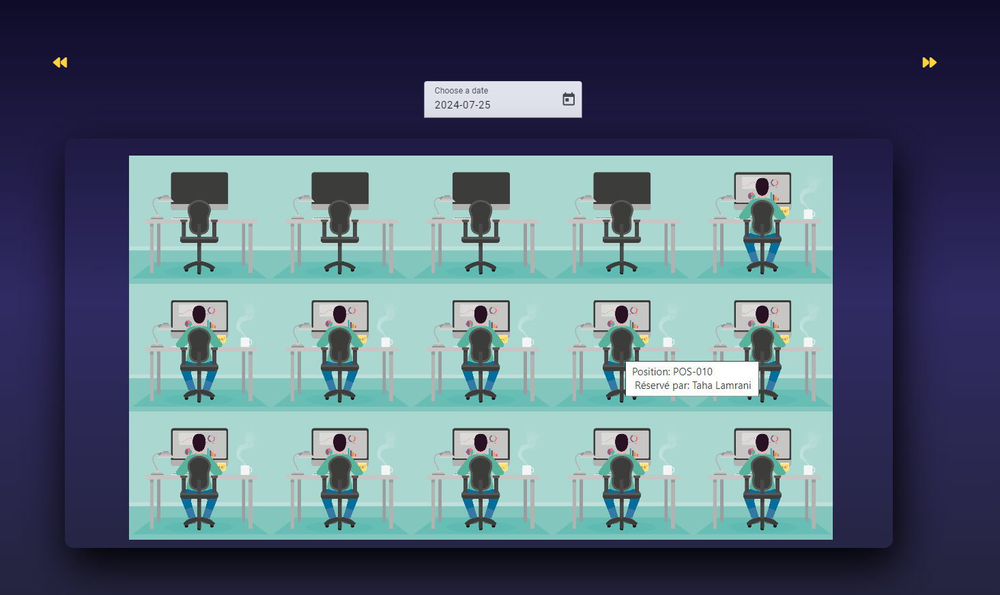
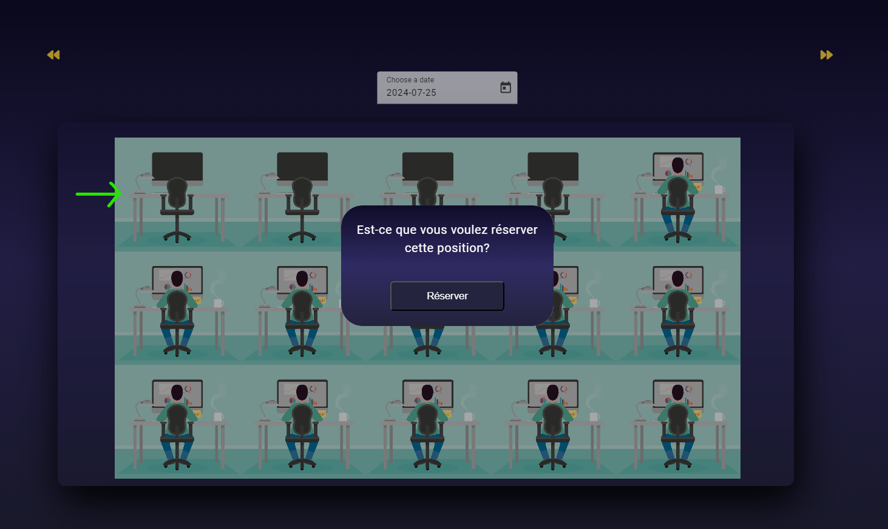

# Don't readme 
⚠️ In order to try the web app with its full functionalities, make sure to clone the <a href = "https://github.com/HafssaRaoui/WorkspaceReservation-SpringBoot-App" >backend repository</a> as well.

# So what's this app is about ?

🎯 The Workspace Reservation Web App is designed to streamline the process of reserving workspaces within an office environment. 

💻 It empowers employees to effortlessly book their preferred desks, ensuring a personalized and organized workspace experience. 

📋  The app allows users to secure their spots with just a few clicks, reducing the hassle of finding available workstations. 

## Technology Stack

- **Frontend:** Developed with the Angular framework for a dynamic and responsive user experience.
- **Backend:** Built using Spring Boot for robust and scalable server-side operations.
- **Database:** Managed with MySQL for reliable and efficient data storage.

## Quick Demo

1. **Login Page**

   
   
1. **Sign in to  your account**

   
    
3. **View the workspace state today or any date you like**
   
   

   Select the date you want to explore using the **date picker** or **the arrows**

     

4. **View Your Work Fellow's Desks**

   

5. **Book your desk in one Click**

   

   ✔️ Reservation done  

      

6. **Explore other features such as:**

   ✔️ Canceling your reservation by clicking on your current position  
   ✔️ Choose your team members optimal work distribution as a team manager  

     

  

  

  

